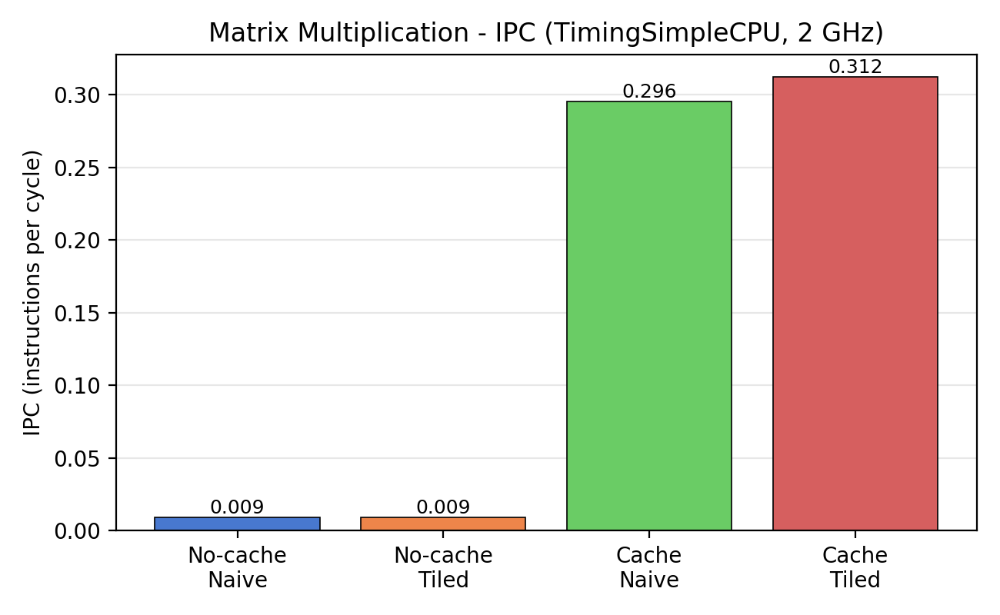

# Computer Architecture Performance Analysis with gem5

A reproducible gem5 study of matrix-multiplication locality, cache behavior, linked-list implementation, and CPU-model effects.

## Experiments

- Naive versus tiled matrix multiplication, with and without caches
- Recursive versus iterative linked-list reversal
- AtomicSimpleCPU versus DerivO3CPU
- IPC, execution time, simulated ticks, cycles, and cache hit/miss behavior

## Key results

| Workload | Configuration | IPC | Simulated time |
|---|---|---:|---:|
| Matrix naive | no cache | 0.008978 | 0.481135 s |
| Matrix tiled | no cache | 0.009065 | 0.496706 s |
| Matrix naive | caches | 0.295654 | 0.014609 s |
| Matrix tiled | caches | 0.312249 | 0.014419 s |
| Linked list recursive | AtomicSimpleCPU | 0.464813 | 0.002290 s |
| Linked list recursive | DerivO3CPU | 0.979591 | 0.001086 s |
| Linked list iterative | AtomicSimpleCPU | 0.469648 | 0.002160 s |
| Linked list iterative | DerivO3CPU | 0.996891 | 0.001017 s |

All matrix configurations produced the same checksum (`20190379`). The included validation script checked 89 conditions with zero failures against the captured gem5 outputs.



## Requirements

- Linux
- gem5 v23.0.0.1 built for X86
- GCC with static-link support
- Python 3, Matplotlib, and Pillow for analysis figures

Set `GEM5_ROOT` if gem5 is not located at `~/gem5`:

```bash
export GEM5_ROOT=/path/to/gem5
```

## Run

```bash
make build
bash scripts/run_all.sh
python3 scripts/extract_stats.py
python3 scripts/validate_results.py
python3 scripts/generate_plots.py
```

## Structure

```text
src/       C workloads
configs/   gem5 configuration for no-cache runs
scripts/   build, run, extraction, validation, and plotting tools
results/   verified summary tables and environment metadata
figures/   selected result visualizations
```

## Author

Mehrdad Sheikh Abbasi
